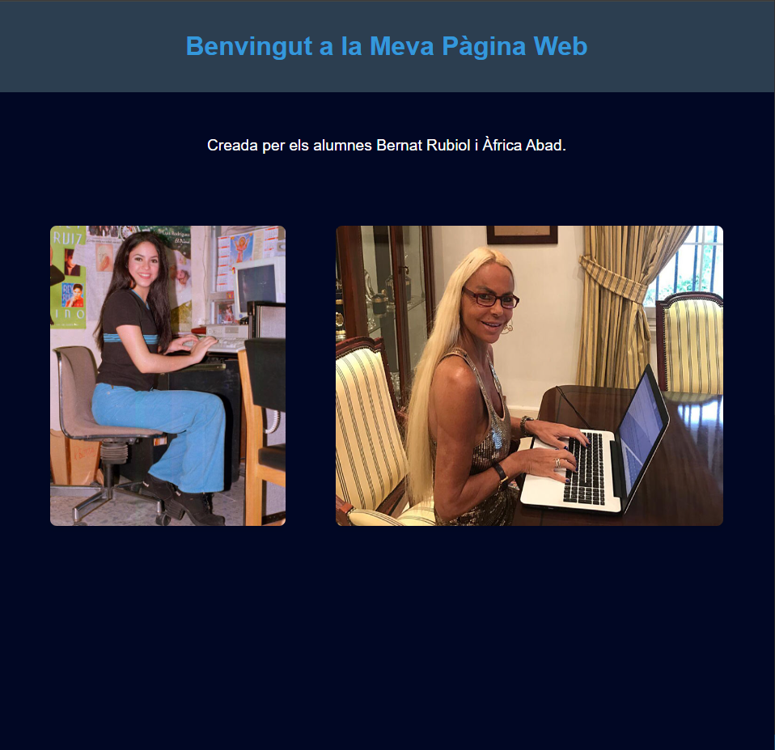

# PRACTICA 3 : WIFI  y BLUETOOTH 
Alumnes: **Bernat Rubiol i Àfrica Abad**

## Objectiu
El objetivo de la practica es comprender el funcionamiento de WIFI Y BT.

Para lo cual realizaremos una practica  donde  generaremos un web server desde utilizando 
nuestra ESP32  y tambien  una comunicacion  serie con una aplicacion de un movil con BT .

## Practica A generación de una pagina web  
### Informe
  
  1. Realizar el informe de funcionamiento  asi como la salida por el terminal  y la  visualización de la conexión a la pagina web con un navegador
  2. Modificar la pagina web generando un fichero HTML con  el editor Mark down e incluirlo en el codigo . Incluir un fichero adicional que solo incluya la pagina html 
  
  Aquest ha estat l'apartat més complicat ja que a classe no ens va funcionar, aixi doncs vaig estar informant-me per internet i vaig trobar aquest article:
  [Enllaç a l'article sobre llegir fitxers](https://randomnerdtutorials.com/esp32-vs-code-platformio-spiffs/)
  On es pot veure com llegir un fitxer txt, aixi doncs en comptes de tenir extenssio `.txt` l'he modificat per a que sigui `.html` i poder-lo incorporar al codi de la pràctica.
  
  Al final treballant amb la mentalitat de primer el txt i despres enviar-ho al servidor es com l'he pogut completar, dividir per vèncer que en diuen

El codi de la pràctica  està complet a l'apartat de [src](src/main.cpp)

Per a llegir el programa he fet servir aquesta funció on entrava el nom del fitxer i ell mateix el buscava el llegia i el retornava com una variable string
  ```cpp
    // Implementació del subprograma per llegir fitxer
    String readFile(String fileName) {
        File file = SPIFFS.open(fileName);
        String content = "";

        if (!file) {
            Serial.println("Failed to open file for reading");
            return content;
        }

        while (file.available()) {
            char c = file.read();
            content += c;
        }

        file.close();
        return content;
    }
  ```
Per a que el fitxer es penji en el servidor:
```cpp
    void handle_root() {
        server.send(200, "text/html", fileContent);
    }

    void setup() {
        Serial.begin(115200);

        //Files setup
        if (!SPIFFS.begin(true)) {
            Serial.println("An Error has occurred while mounting SPIFFS");
            return;
        }

        fileContent = readFile("/index.html"); // Assigna el contingut a la variable global
        delay(1000);

        //Web setup
        Serial.println("Try Connecting to ");
        Serial.println(ssid);
        WiFi.begin(ssid, password);
        while (WiFi.status() != WL_CONNECTED) {
            delay(1000);
            Serial.print(".");
        }
        Serial.println("");
        Serial.println("WiFi connected successfully");
        Serial.print("Got IP: ");
        Serial.println(WiFi.localIP());  //Show ESP32 IP on serial

        server.begin();
        Serial.println("HTTP server started");
        
        server.on("/", handle_root);
    }
```

  3. Generar informe  y codigo  en Github

  Un cop s'entra a la IP que s'ens dona per el serial port es pot veure la següent web amb un titol, un subtitol i dos imatges dels alumnes treballant:

  

  